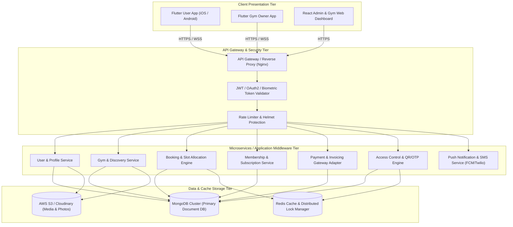
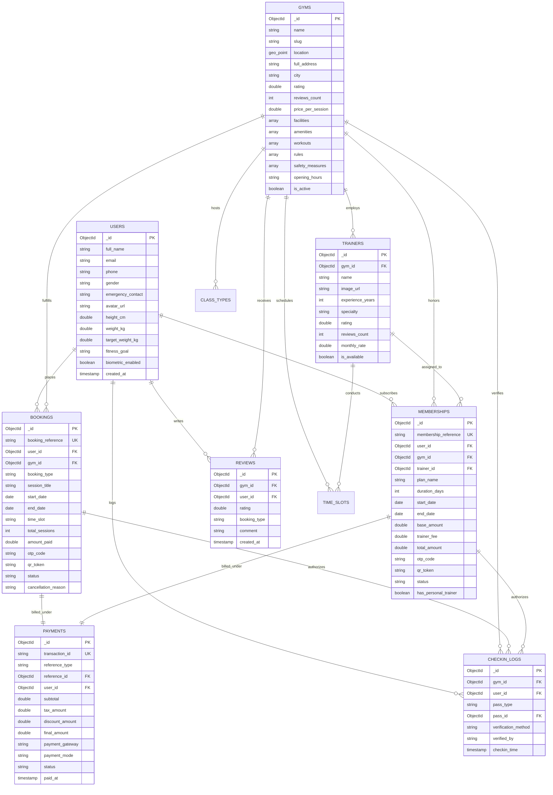
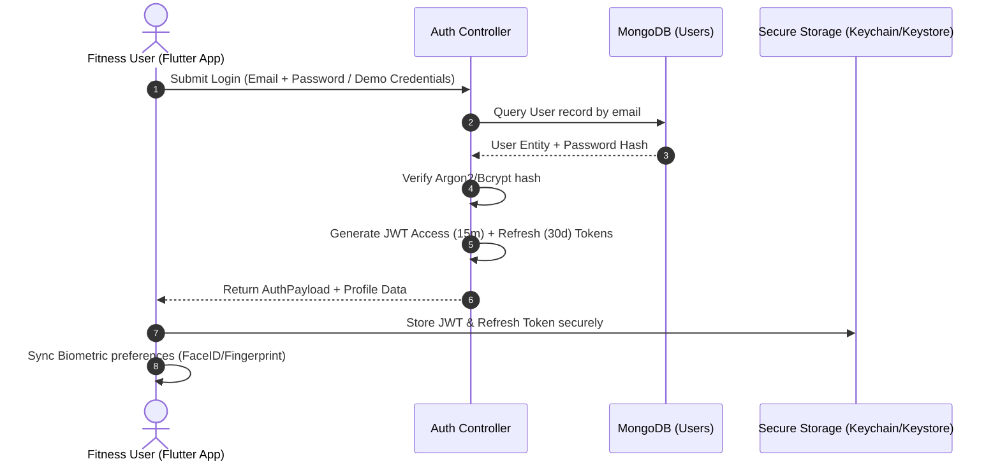
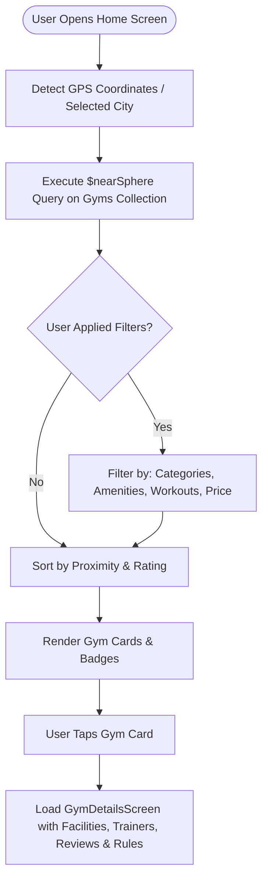
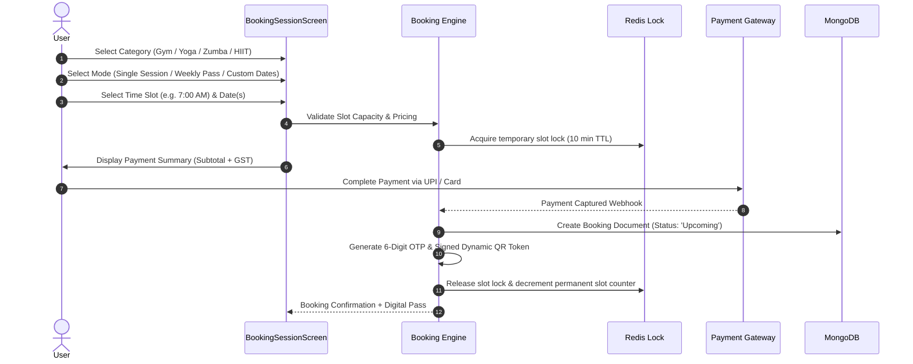
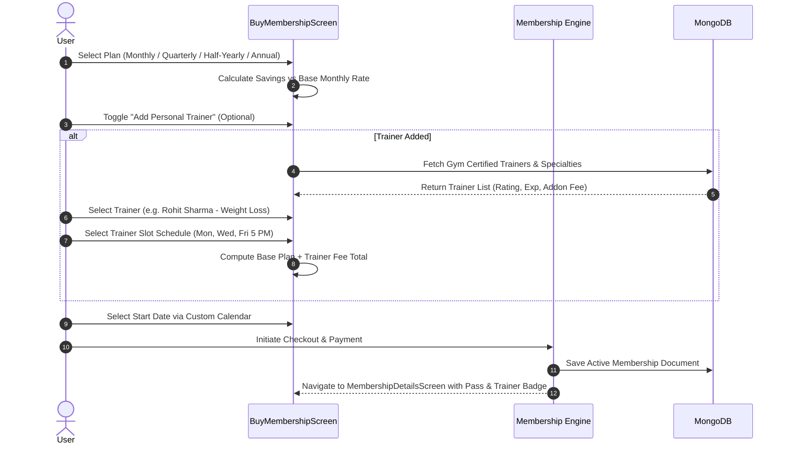
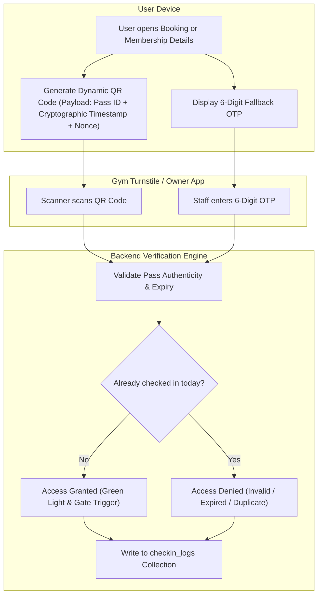
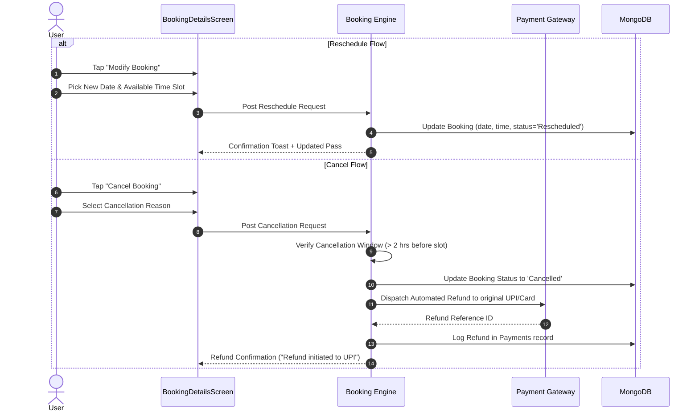
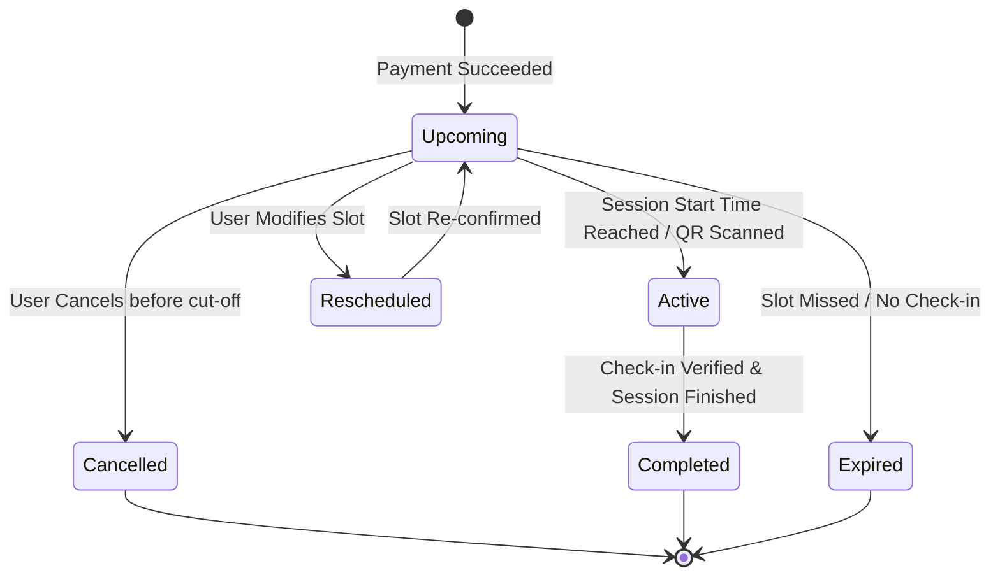
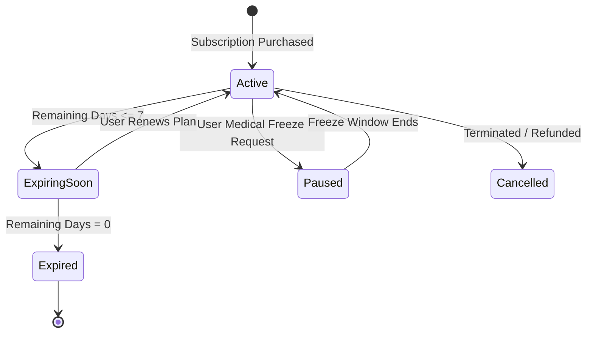

# GYMEZY Platform — Comprehensive Industry Specification & Database Architecture Document

> **Document Version:** 1.0.0  
> **Target Systems:** Mobile (Flutter - User & Gym Owner), Backend Middleware (Node.js/Express/MongoDB), Web Portal (React/Vite)  
> **Status:** Production-Ready Architectural Reference  

---

## Table of Contents
1. [Executive Summary & Product Concept](#1-executive-summary--product-concept)
2. [High-Level System Architecture](#2-high-level-system-architecture)
3. [Database Architecture & Data Models (DB Architecture)](#3-database-architecture--data-models-db-architecture)
   - 3.1 [Entity-Relationship Diagram (ERD)](#31-entity-relationship-diagram-erd)
   - 3.2 [Schema Specifications & Data Dictionaries](#32-schema-specifications--data-dictionaries)
   - 3.3 [Database Indexing & Optimization Strategy](#33-database-indexing--optimization-strategy)
4. [Detailed System & User Workflows](#4-detailed-system--user-workflows)
   - 4.1 [User Authentication & Profile Initialization](#41-user-authentication--profile-initialization)
   - 4.2 [Gym Discovery & Geo-Spatial Search](#42-gym-discovery--geo-spatial-search)
   - 4.3 [Pay-Per-Session & Multi-Day Class Booking Lifecycle](#43-pay-per-session--multi-day-class-booking-lifecycle)
   - 4.4 [Tiered Membership & Personal Trainer Addon Workflow](#44-tiered-membership--personal-trainer-addon-workflow)
   - 4.5 [Digital QR Pass Access Control & Check-in Verification](#45-digital-qr-pass-access-control--check-in-verification)
   - 4.6 [Rescheduling, Cancellation & Refund Lifecycle](#46-rescheduling-cancellation--refund-lifecycle)
5. [State Machine Architecture](#5-state-machine-architecture)
6. [API Architecture & RESTful Endpoint Contracts](#6-api-architecture--restful-endpoint-contracts)
7. [Non-Functional Requirements, Security & Scalability](#7-non-functional-requirements-security--scalability)

---

## 1. Executive Summary & Product Concept

**GYMEZY** is a next-generation fitness-tech ecosystem designed to democratize fitness facility access. It bridges fitness enthusiasts with certified gyms, specialized fitness studios (Yoga, Zumba, HIIT, CrossFit, Boxing), and certified personal trainers without locking users into restrictive long-term commitments.

### Core Value Pillars
1. **Pay-As-You-Go Flexibility:** Single-session passes, 5-day batches, and weekly passes for gym floor workouts and studio classes.
2. **Tiered Long-Term Memberships:** 30-day (Monthly), 90-day (Quarterly), 180-day (Half-Yearly), and 365-day (Annual) packages with clear savings calculation.
3. **Personal Training Integration:** Real-time trainer matching based on fitness goals (Weight Loss, Hypertrophy, Strength, HIIT) with schedule synchronization.
4. **Contactless Access Control:** Tamper-proof, cryptographically signed dynamic QR passes paired with 6-digit fallback OTPs for check-in verification at gym turnstiles and front desks.
5. **Holistic Fitness Profile:** BMI analytics, body metrics tracking, custom workout reminders, and attendance history.

---

## 2. High-Level System Architecture



---

## 3. Database Architecture & Data Models (DB Architecture)

### 3.1 Entity-Relationship Diagram (ERD)



---

### 3.2 Schema Specifications & Data Dictionaries

#### 1. `users` Collection
Stores user identity, authentication metadata, biometric preferences, and dynamic health/fitness metrics.

```json
{
  "_id": { "$type": "objectId" },
  "full_name": { "$type": "string" },
  "email": { "$type": "string" },
  "phone": { "$type": "string" },
  "password_hash": { "$type": "string" },
  "gender": { "$type": "string", "enum": ["Male", "Female", "Other", "Prefer not to say"] },
  "avatar_url": { "$type": "string" },
  "emergency_contact": {
    "name": { "$type": "string" },
    "phone": { "$type": "string" },
    "relationship": { "$type": "string" }
  },
  "fitness_metrics": {
    "height_cm": { "$type": "double" },
    "weight_kg": { "$type": "double" },
    "target_weight_kg": { "$type": "double" },
    "bmi": { "$type": "double" },
    "bmi_category": { "$type": "string" },
    "primary_goal": { "$type": "string" }
  },
  "preferences": {
    "workout_reminders": { "$type": "bool", "default": true },
    "pass_expiry_alerts": { "$type": "bool", "default": true },
    "biometric_login": { "$type": "bool", "default": false },
    "saved_gym_bookmarks": [{ "$type": "objectId" }]
  },
  "created_at": { "$type": "date" },
  "updated_at": { "$type": "date" }
}
```

#### 2. `gyms` Collection
Stores fitness center profiles, geo-spatial coordinates, amenity lists, rules, and pricing baselines.

```json
{
  "_id": { "$type": "objectId" },
  "name": { "$type": "string" },
  "slug": { "$type": "string" },
  "location": {
    "type": { "$type": "string", "enum": ["Point"], "default": "Point" },
    "coordinates": [{ "$type": "double" }, { "$type": "double" }] // [longitude, latitude]
  },
  "area": { "$type": "string" },
  "city": { "$type": "string" },
  "full_address": { "$type": "string" },
  "pincode": { "$type": "string" },
  "images": [{ "$type": "string" }],
  "rating": { "$type": "double", "default": 0.0 },
  "reviews_count": { "$type": "int", "default": 0 },
  "price_per_session": { "$type": "double" },
  "tags": [{ "$type": "string" }],
  "badge_text": { "$type": "string" },
  "about_text": { "$type": "string" },
  "opening_hours": {
    "open_time": { "$type": "string" },
    "close_time": { "$type": "string" },
    "displayText": { "$type": "string" }
  },
  "facilities": [{ "$type": "string" }],
  "amenities": [{ "$type": "string" }],
  "workouts": [{ "$type": "string" }],
  "rules": [{ "$type": "string" }],
  "safety_measures": [{ "$type": "string" }],
  "is_active": { "$type": "bool", "default": true },
  "created_at": { "$type": "date" },
  "updated_at": { "$type": "date" }
}
```

#### 3. `trainers` Collection
Represents fitness coaches, their master specialties, credentials, schedules, and fee structures.

```json
{
  "_id": { "$type": "objectId" },
  "gym_id": { "$type": "objectId" },
  "name": { "$type": "string" },
  "image_url": { "$type": "string" },
  "experience_years": { "$type": "int" },
  "specialty": { "$type": "string" },
  "bio": { "$type": "string" },
  "rating": { "$type": "double" },
  "reviews_count": { "$type": "int" },
  "monthly_addon_fee": { "$type": "double" },
  "available_slots": [
    {
      "day_pattern": { "$type": "string" }, // e.g. "Mon, Wed, Fri"
      "start_time": { "$type": "string" },
      "end_time": { "$type": "string" },
      "max_clients": { "$type": "int", "default": 5 }
    }
  ],
  "is_active": { "$type": "bool", "default": true }
}
```

#### 4. `bookings` Collection
Covers on-demand session bookings, weekly unlimited passes, and multi-day class batches (Yoga, Zumba, HIIT, etc.).

```json
{
  "_id": { "$type": "objectId" },
  "booking_reference": { "$type": "string" }, // e.g., "FSB123456"
  "user_id": { "$type": "objectId" },
  "customer_id": { "$type": "string" },
  "gym_id": { "$type": "objectId" },
  "category": { "$type": "string", "enum": ["Gym", "Yoga", "Zumba", "HIIT", "CrossFit", "Boxing"] },
  "booking_type": { "$type": "string", "enum": ["Per Session", "Weekly Plan", "Custom Dates", "Group Class"] },
  "session_subtitle": { "$type": "string" },
  "dates": [{ "$type": "date" }],
  "start_date": { "$type": "date" },
  "end_date": { "$type": "date" },
  "time_slot": { "$type": "string" },
  "days_booked_label": { "$type": "string" },
  "amount_paid": { "$type": "double" },
  "payment_id": { "$type": "objectId" },
  "payment_mode": { "$type": "string", "enum": ["UPI", "Card", "NetBanking", "Wallet"] },
  "otp": { "$type": "string" }, // 6-digit OTP
  "qr_hash": { "$type": "string" }, // Encrypted payload for QR code scanner
  "status": { "$type": "string", "enum": ["Upcoming", "Active", "Completed", "Cancelled", "Rescheduled"] },
  "cancellation_reason": { "$type": "string" },
  "cancellation_timestamp": { "$type": "date" },
  "created_at": { "$type": "date" },
  "updated_at": { "$type": "date" }
}
```

#### 5. `memberships` Collection
Covers long-term subscription tiers with optional personal trainer add-ons.

```json
{
  "_id": { "$type": "objectId" },
  "membership_reference": { "$type": "string" }, // e.g., "MBR123456"
  "user_id": { "$type": "objectId" },
  "customer_id": { "$type": "string" },
  "gym_id": { "$type": "objectId" },
  "plan_name": { "$type": "string", "enum": ["Monthly", "Quarterly", "Half Yearly", "Annual"] },
  "duration_days": { "$type": "int" },
  "start_date": { "$type": "date" },
  "end_date": { "$type": "date" },
  "base_amount": { "$type": "double" },
  "has_personal_trainer": { "$type": "bool" },
  "trainer_id": { "$type": "objectId" },
  "trainer_name": { "$type": "string" },
  "trainer_specialty": { "$type": "string" },
  "trainer_schedule": { "$type": "string" },
  "trainer_fee": { "$type": "double" },
  "total_amount_paid": { "$type": "double" },
  "payment_id": { "$type": "objectId" },
  "payment_mode": { "$type": "string" },
  "otp": { "$type": "string" },
  "qr_hash": { "$type": "string" },
  "status": { "$type": "string", "enum": ["Active", "Expiring Soon", "Expired", "Cancelled", "Paused"] },
  "created_at": { "$type": "date" },
  "updated_at": { "$type": "date" }
}
```

#### 6. `payments` Collection
Stores full transaction histories, invoice breakdowns, payment gateway IDs, and refund traces.

```json
{
  "_id": { "$type": "objectId" },
  "transaction_id": { "$type": "string" }, // e.g., "TXN_987654321"
  "order_id": { "$type": "string" },
  "user_id": { "$type": "objectId" },
  "reference_type": { "$type": "string", "enum": ["Booking", "Membership"] },
  "reference_id": { "$type": "objectId" },
  "subtotal": { "$type": "double" },
  "convenience_fee": { "$type": "double" },
  "tax_amount": { "$type": "double" },
  "discount_amount": { "$type": "double" },
  "total_amount": { "$type": "double" },
  "currency": { "$type": "string", "default": "INR" },
  "payment_gateway": { "$type": "string", "enum": ["Razorpay", "Stripe", "Cashfree"] },
  "gateway_payment_id": { "$type": "string" },
  "payment_mode": { "$type": "string" },
  "status": { "$type": "string", "enum": ["Pending", "Captured", "Failed", "Refunded"] },
  "refund_details": {
    "refund_id": { "$type": "string" },
    "amount": { "$type": "double" },
    "status": { "$type": "string" },
    "initiated_at": { "$type": "date" }
  },
  "created_at": { "$type": "date" }
}
```

#### 7. `checkin_logs` Collection
Audit trail for access control, physical presence tracking, and scanner device logging.

```json
{
  "_id": { "$type": "objectId" },
  "gym_id": { "$type": "objectId" },
  "user_id": { "$type": "objectId" },
  "pass_type": { "$type": "string", "enum": ["Booking", "Membership"] },
  "pass_id": { "$type": "objectId" },
  "reference_code": { "$type": "string" },
  "verification_method": { "$type": "string", "enum": ["QR_SCAN", "MANUAL_OTP"] },
  "verified_by_device_id": { "$type": "string" },
  "timestamp": { "$type": "date" },
  "status": { "$type": "string", "enum": ["Granted", "Denied", "Expired", "Duplicate"] }
}
```

---

### 3.3 Database Indexing & Optimization Strategy

| Collection | Index Fields | Type | Purpose |
| :--- | :--- | :--- | :--- |
| `gyms` | `{ "location": "2dsphere" }` | Geospatial | Real-time proximity search (`$nearSphere` / `$geoWithin`) |
| `gyms` | `{ "city": 1, "is_active": 1 }` | Compound | Fast filtering by active gyms in a city |
| `gyms` | `{ "tags": 1, "workouts": 1 }` | Multi-key | Category filter optimization |
| `users` | `{ "email": 1 }` / `{ "phone": 1 }` | Unique | Identity deduplication & fast auth lookup |
| `bookings` | `{ "booking_reference": 1 }` | Unique | O(1) Booking verification & QR lookup |
| `bookings` | `{ "user_id": 1, "status": 1, "start_date": -1 }` | Compound | Fetching user's active/upcoming bookings |
| `memberships` | `{ "user_id": 1, "status": 1, "end_date": -1 }` | Compound | Active membership resolution |
| `payments` | `{ "transaction_id": 1 }` | Unique | Payment idempotency & reconciliation |
| `checkin_logs` | `{ "gym_id": 1, "timestamp": -1 }` | Compound | Gym owner daily attendance stream |

---

## 4. Detailed System & User Workflows

### 4.1 User Authentication & Profile Initialization



---

### 4.2 Gym Discovery & Geo-Spatial Search



---

### 4.3 Pay-Per-Session & Multi-Day Class Booking Lifecycle



---

### 4.4 Tiered Membership & Personal Trainer Addon Workflow



---

### 4.5 Digital QR Pass Access Control & Check-in Verification



---

### 4.6 Rescheduling, Cancellation & Refund Lifecycle



---

## 5. State Machine Architecture

### Booking Lifecycle State Transition



### Membership Lifecycle State Transition



---

## 6. API Architecture & RESTful Endpoint Contracts

### 6.1 Authentication & Profile
- `POST /api/v1/auth/login` — Authenticate user via email/password or OTP.
- `POST /api/v1/auth/refresh-token` — Rotate expired access tokens.
- `GET /api/v1/users/profile` — Fetch personal details, health metrics, and BMI statistics.
- `PATCH /api/v1/users/profile` — Update emergency contacts, fitness goals, and notification preferences.

### 6.2 Gym Discovery
- `GET /api/v1/gyms` — Search gyms with query parameters: `lat`, `lng`, `radius_km`, `category`, `workout`, `facility`, `search`.
- `GET /api/v1/gyms/:gymId` — Get comprehensive gym profile, facilities, rules, reviews, and trainer rosters.
- `POST /api/v1/gyms/:gymId/bookmark` — Toggle gym bookmark status.

### 6.3 Bookings & Sessions
- `GET /api/v1/gyms/:gymId/slots` — Get available morning and evening slots for a specific date and category.
- `POST /api/v1/bookings/reserve` — Lock slot for 10 minutes prior to payment checkout.
- `POST /api/v1/bookings/confirm` — Create booking record upon payment gateway webhook confirmation.
- `GET /api/v1/bookings/my-bookings` — List user bookings filtered by `status=Upcoming|Completed|Cancelled`.
- `PATCH /api/v1/bookings/:bookingId/reschedule` — Update date and time slot.
- `POST /api/v1/bookings/:bookingId/cancel` — Cancel booking and initiate refund.

### 6.4 Memberships
- `GET /api/v1/gyms/:gymId/plans` — Fetch active membership tiers and seasonal discounts.
- `POST /api/v1/memberships/checkout` — Purchase membership with optional trainer add-on.
- `GET /api/v1/memberships/my-memberships` — Retrieve active and historical memberships.

### 6.5 Access Control & Validation (Gym Staff / Turnstile API)
- `POST /api/v1/access/verify-qr` — Decrypt and validate dynamic QR code payload.
- `POST /api/v1/access/verify-otp` — Validate 6-digit backup OTP code.

---

## 7. Non-Functional Requirements, Security & Scalability

### 7.1 Security & Access Control
- **Cryptographic QR Tokens:** Dynamic QR payloads generated using HMAC-SHA256 with a 60-second rolling validity to prevent screenshot sharing (anti-passback protection).
- **Transport Security:** Strict TLS 1.3 encryption across all client-to-gateway and gateway-to-microservice communication.
- **Biometric Security:** Local biometric tokens (FaceID/Fingerprint) unlock access without re-transmitting cleartext credentials.

### 7.2 Scalability & Concurrency
- **Distributed Slot Locking:** Redis distributed locks (`Redlock`) guarantee no two users can book the same capacity-constrained class slot simultaneously during peak rush hours.
- **Geo-Spatial Query Caching:** Frequent location-based search results cached in Redis with a 5-minute TTL.

### 7.3 High Availability & Observability
- **Database Replication:** MongoDB Replica Set with automatic failover and read-preference distribution (`primaryPreferred`).
- **Telemetry & Monitoring:** Structured Winston/Morgan logging, Prometheus metrics, and APM tracing for all booking and payment state transitions.

---
*Authored for the GYMEZY Platform Engineering & Architecture Team.*
