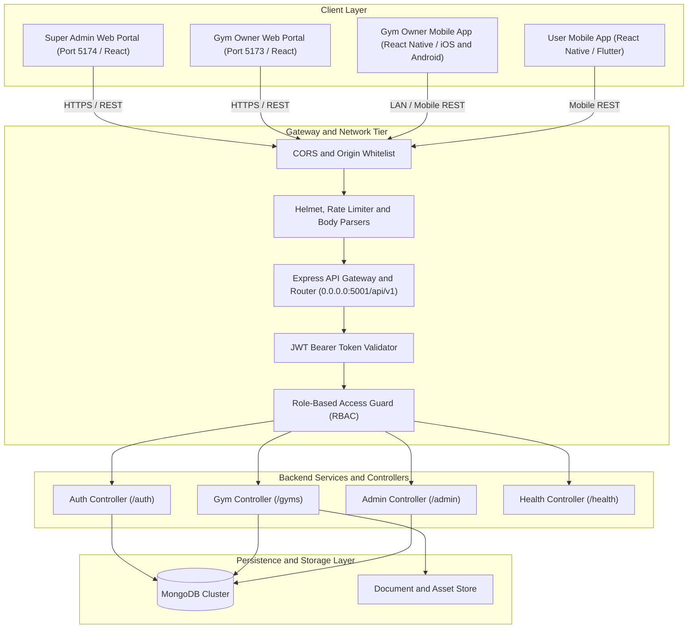
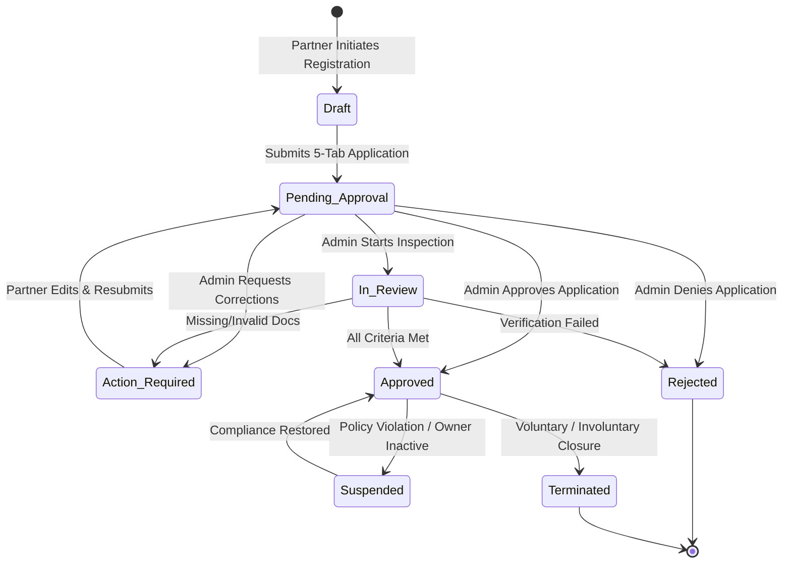
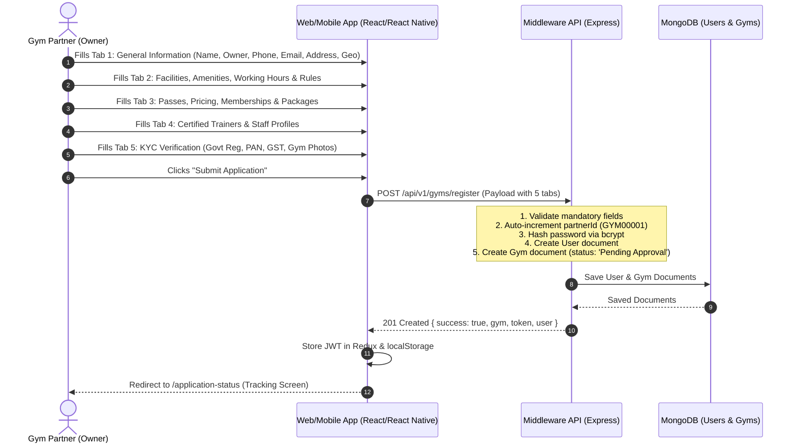
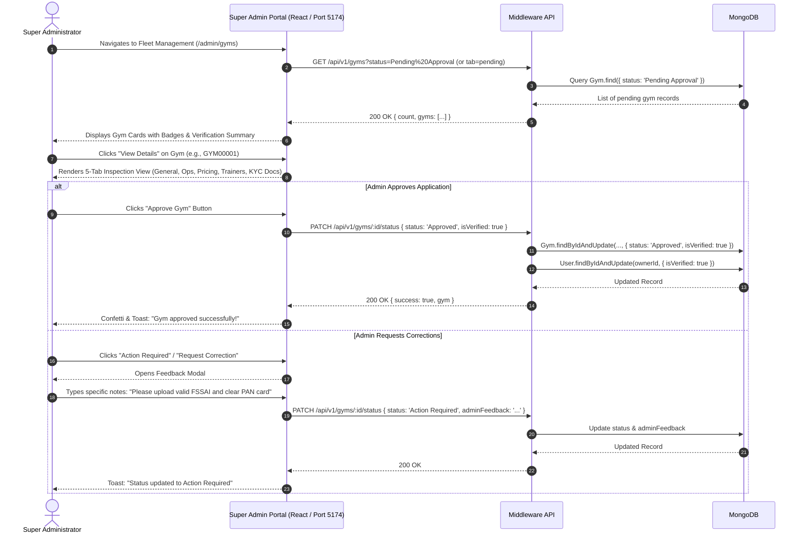
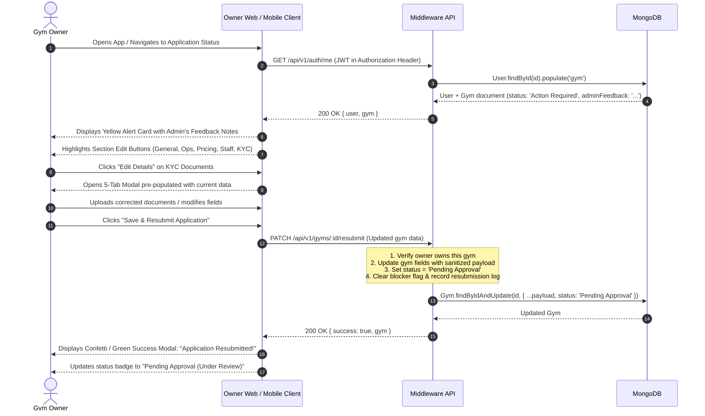
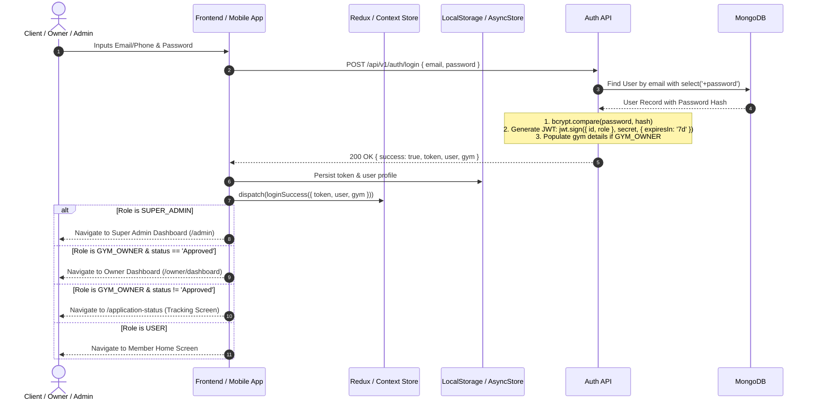
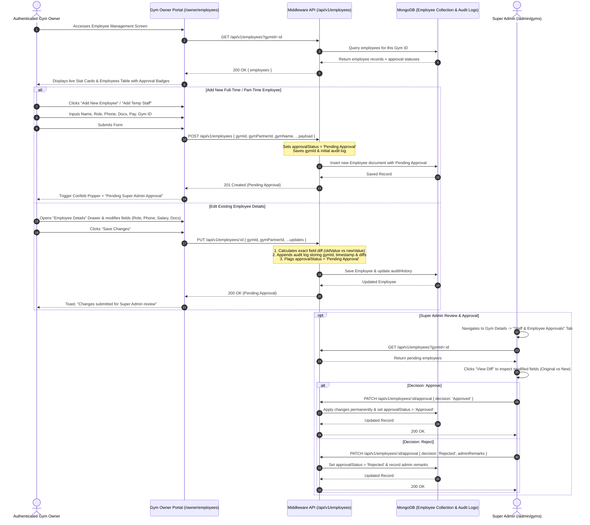
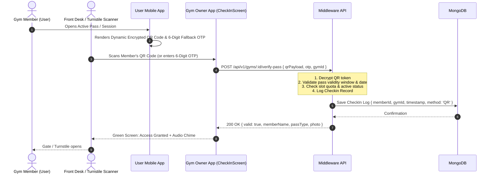

# GYMEZY Platform — End-to-End System Logic Flow & Architecture Specification

> **Document Version:** 2.0.0 (Production Release)  
> **Target Audience:** Solution Architects, Backend Engineers, Frontend Engineers, Mobile Engineers, QA, DevOps  
> **Platforms Covered:**
> - **Super Admin Web Portal** (`web-application/super-admin` — React, Vite, Redux Toolkit, Ant Design)
> - **Gym Owner Web Portal** (`web-application/gym-owner` — React, Vite, Redux Toolkit, Ant Design)
> - **Gym Owner Mobile App** (`mobile-application/gym-owner` — React Native, React Navigation, Axios)
> - **Backend Middleware** (`middleware` — Node.js, Express, MongoDB/Mongoose, JWT, Multer)
> - **Client User Mobile App** (`mobile-application/user` — Cross-platform Member Portal)
>
> **Last Updated:** October 2026

---

## Table of Contents

1. [Executive Summary & Architectural Topography](#1-executive-summary--architectural-topography)
2. [Actor Roles & Security Hierarchy (RBAC)](#2-actor-roles--security-hierarchy-rbac)
3. [Gym Partner Lifecycle State Machine](#3-gym-partner-lifecycle-state-machine)
4. [End-to-End Core Workflows](#4-end-to-end-core-workflows)
   - 4.1 [Workflow 1: Gym Partner Self-Registration & Multi-Tab Onboarding](#41-workflow-1-gym-partner-self-registration--multi-tab-onboarding)
   - 4.2 [Workflow 2: Super Admin Verification & Decision Engine](#42-workflow-2-super-admin-verification--decision-engine)
   - 4.3 [Workflow 3: Application Status Tracking, Section-by-Section Edit & Resubmission](#43-workflow-3-application-status-tracking-section-by-section-edit--resubmission)
   - 4.4 [Workflow 4: Authentication, Token Management & Session Hydration](#44-workflow-4-authentication-token-management--session-hydration)
   - 4.5 [Workflow 5: Gym Owner Operations & Live Staff/Employee Management](#45-workflow-5-gym-owner-operations--live-staffemployee-management)
   - 4.6 [Workflow 6: Contactless Access Control & Check-in Verification](#46-workflow-6-contactless-access-control--check-in-verification)
5. [Complete REST API Contract & Endpoint Dictionary](#5-complete-rest-api-contract--endpoint-dictionary)
6. [Database Schema Specifications & Mongoose Models](#6-database-schema-specifications--mongoose-models)
7. [Cross-Platform State Management & Network Architecture](#7-cross-platform-state-management--network-architecture)
8. [Production Error Handling, Logging & Security Safeguards](#8-production-error-handling-logging--security-safeguards)

---

## 1. Executive Summary & Architectural Topography

GYMEZY is an enterprise fitness ecosystem connecting fitness centers (gyms, yoga studios, CrossFit boxes, combat academies) with consumers via on-demand sessions, multi-day passes, and memberships.



---

## 2. Actor Roles & Security Hierarchy (RBAC)

The system enforces strict multi-tenancy and Role-Based Access Control (RBAC).

| Role Key | System Name | Privileges & Scope | Permitted Interfaces |
|---|---|---|---|
| `SUPER_ADMIN` | Platform Super Administrator | Full fleet visibility; approval/rejection of partner applications; financial audits; global system metrics. | `web-application/super-admin` |
| `GYM_OWNER` | Gym Partner Owner | Registration, profile editing, trainer & employee management, member attendance, check-in access, tier pricing, earnings analytics. | `web-application/gym-owner`, `mobile-application/gym-owner` |
| `STAFF` | Front Desk / Trainer | Limited gym console: member check-in verification, class attendance, personal trainer client logs. | `web-application/gym-owner`, `mobile-application/gym-owner` |
| `USER` | Member / Fitness Enthusiast | Search facilities, purchase flexible passes, book trainer sessions, generate dynamic QR check-in passes. | `mobile-application/user` |

---

## 3. Gym Partner Lifecycle State Machine

Every gym facility registered on GYMEZY progresses through a deterministic lifecycle state machine:



### State Machine Transition Rules

| Initial State | Event / Trigger | Target State | Permitted By | Business Logic & Side Effects |
|---|---|---|---|---|
| *Unregistered* | `POST /api/v1/gyms/register` | `Pending Approval` | Public / Guest | Generates `partnerId` (`GYM00001`), creates `User` (`role: GYM_OWNER`, `isVerified: false`), saves complete gym payload, sets `status: 'Pending Approval'`. |
| `Pending Approval` | `PATCH /api/v1/gyms/:id/status` (`In Review`) | `In Review` | `SUPER_ADMIN` | Admin begins document inspection. Notifies owner via dashboard. |
| `Pending Approval` / `In Review` | `PATCH /api/v1/gyms/:id/status` (`Action Required`) | `Action Required` | `SUPER_ADMIN` | Requires `adminFeedback` string. Sets `rejectionReason`/`adminFeedback`, leaves `isVerified: false`. Unlocks editing modal on Owner Web & Mobile. |
| `Pending Approval` / `In Review` | `PATCH /api/v1/gyms/:id/status` (`Rejected`) | `Rejected` | `SUPER_ADMIN` | Sets rejection remarks. Application cannot operate. |
| `Pending Approval` / `In Review` | `PATCH /api/v1/gyms/:id/status` (`Approved`) | `Approved` | `SUPER_ADMIN` | Sets `isVerified: true`, `status: 'Approved'`. Activates Owner account login, unlocks full Owner Dashboard & Mobile App. |
| `Action Required` | `PATCH /api/v1/gyms/:id/resubmit` | `Pending Approval` | `GYM_OWNER` / `SUPER_ADMIN` | Saves corrected form sections, clears previous blocker flag, timestamps `resubmittedAt`, moves back to Super Admin verification queue. |
| `Approved` | `PATCH /api/v1/gyms/:id/status` (`Suspended`) | `Suspended` | `SUPER_ADMIN` | Temporarily delists facility from public discovery; freezes owner payout transfers. |

---

## 4. End-to-End Core Workflows

### 4.1 Workflow 1: Gym Partner Self-Registration & Multi-Tab Onboarding



---

### 4.2 Workflow 2: Super Admin Verification & Decision Engine



---

### 4.3 Workflow 3: Application Status Tracking, Section-by-Section Edit & Resubmission

Both the Gym Owner Web App (`http://localhost:5173/application-status`) and Gym Owner Mobile App (`ApplicationStatusScreen.js`) provide real-time status monitoring, admin feedback viewing, section-by-section editing, and resubmission.



---

### 4.4 Workflow 4: Authentication, Token Management & Session Hydration



---

### 4.5 Workflow 5: Gym Owner Operations & Live Staff/Employee Management with Super Admin Approval & Edit Diff Tracking



---

### 4.6 Workflow 6: Contactless Access Control & Check-in Verification



---

## 5. Complete REST API Contract & Endpoint Dictionary

Base URI: `http://localhost:5001/api/v1` (or LAN IP `http://<LAN_IP>:5001/api/v1`)

### 5.1 Authentication (`/auth`)

| HTTP Method | Route | Auth Required | Request Body | Response (200/201) | Description |
|---|---|---|---|---|---|
| `POST` | `/auth/login` | None | `{ email, password }` | `{ success: true, token, user: { id, email, role, gym } }` | Authenticates user and returns signed JWT token. |
| `GET` | `/auth/me` | `Bearer JWT` | None | `{ success: true, user: { ...populatedWithGym } }` | Fetches current user profile and linked gym facility. |
| `POST` | `/auth/logout` | None | None | `{ success: true, message: 'Logged out successfully' }` | Clears server-side cookie if set. |
| `GET` / `POST` | `/auth/check-email` | None | `{ email }` or `?email=...` | `{ success: true, available: boolean }` | Verifies whether an email address is available for registration. |

---

### 5.2 Gym Partner Operations (`/gyms`)

| HTTP Method | Route | Auth Required | Role Allowed | Description |
|---|---|---|---|---|
| `POST` | `/gyms/register` | None | Public | Partner self-registration with full 5-tab payload. Sets status to `Pending Approval`. |
| `POST` | `/gyms/onboard` | `Bearer JWT` | `SUPER_ADMIN` | Admin-assisted gym onboarding with automatic credentials creation. |
| `GET` | `/gyms` | `Bearer JWT` | Any Authenticated | Fleet query with filters (`?status=Approved`, `?tab=pending`, `?search=...`, `?page=1&limit=10`). |
| `GET` | `/gyms/:id` | `Bearer JWT` | Any Authenticated | Retrieve single gym by Mongo `_id`, `partnerId`, or `slug`. |
| `PUT` / `PATCH` | `/gyms/:id` | `Bearer JWT` | `GYM_OWNER`, `SUPER_ADMIN` | Update gym profile, amenities, pricing, staff, working hours. |
| `PATCH` | `/gyms/:id/status` | `Bearer JWT` | `SUPER_ADMIN` | Update lifecycle state (`Approved`, `Action Required`, `Rejected`, `Suspended`) with optional `adminFeedback`. |
| `POST` / `PATCH` | `/gyms/:id/resubmit` | `Bearer JWT` | `GYM_OWNER`, `SUPER_ADMIN` | Resubmit corrected application after `Action Required`. Sets status back to `Pending Approval`. |
| `DELETE` | `/gyms/:id` | `Bearer JWT` | `SUPER_ADMIN` | Delete gym record and unlink owner profile. |

---

### 5.3 Super Admin Console (`/admin`)

| HTTP Method | Route | Auth Required | Role Allowed | Description |
|---|---|---|---|---|
| `GET` | `/admin/dashboard-stats` | `Bearer JWT` | `SUPER_ADMIN` | Returns aggregated metrics: total gyms, pending verification count, approved active gyms, total revenue, monthly trends. |

---

### 5.4 System Health (`/health`)

| HTTP Method | Route | Auth Required | Description |
|---|---|---|---|
| `GET` | `/health` | None | Returns server uptime, database connection status, memory utilization, and local timestamp. |

---

## 6. Database Schema Specifications & Mongoose Models

### 6.1 `User` Schema (`models/user.model.js`)

```javascript
const UserSchema = new mongoose.Schema({
  name: { type: String, required: true, trim: true },
  email: { type: String, required: true, unique: true, lowercase: true, index: true },
  phone: { type: String, required: true, trim: true },
  password: { type: String, required: true, select: false },
  role: { 
    type: String, 
    enum: ['SUPER_ADMIN', 'GYM_OWNER', 'STAFF', 'USER'], 
    default: 'USER',
    index: true 
  },
  gym: { type: mongoose.Schema.Types.ObjectId, ref: 'Gym' },
  avatar: { type: String, default: '' },
  isVerified: { type: Boolean, default: false },
  status: { type: String, enum: ['Active', 'Inactive', 'Suspended'], default: 'Active' },
}, { timestamps: true });
```

### 6.2 `Gym` Schema (`models/gym.model.js`)

```javascript
const GymSchema = new mongoose.Schema({
  partnerId: { type: String, unique: true, index: true }, // e.g. "GYM00001"
  name: { type: String, required: true, trim: true },
  legalBusinessName: { type: String, trim: true },
  slug: { type: String, unique: true, lowercase: true, index: true },
  owner: { type: mongoose.Schema.Types.ObjectId, ref: 'User', required: true },
  ownerName: { type: String, required: true },
  ownerPhone: { type: String, required: true },
  ownerEmail: { type: String, required: true },
  
  // Location & Geo
  location: {
    address: { type: String, required: true },
    city: { type: String, required: true, index: true },
    state: { type: String, required: true },
    pincode: { type: String, required: true },
    coordinates: {
      type: [Number], // [longitude, latitude]
      index: '2dsphere'
    }
  },

  // Operations & Timings
  timing: {
    weekdays: { open: String, close: String },
    weekends: { open: String, close: String }
  },
  facilities: [{ type: String }],
  amenities: [{ type: String }],
  rules: [{ type: String }],

  // Pricing & Passes
  passPlans: [{
    planType: { type: String, enum: ['Single', '5_Days', 'Weekly', 'Monthly', 'Annual'] },
    name: String,
    price: Number,
    discountedPrice: Number,
    validityDays: Number,
    description: String
  }],

  // Certified Staff & Trainers
  trainers: [{
    name: String,
    phone: String,
    email: String,
    specialty: String,
    experienceYears: Number,
    certifications: [String],
    image: String
  }],
  staff: [{
    name: String,
    phone: String,
    email: String,
    designation: String,
    type: { type: String, enum: ['Full-Time', 'Part-Time', 'Temporary'] }
  }],

  // KYC & Compliance Documents
  kycDocuments: {
    govtRegistration: { fileData: String, fileName: String, verified: Boolean },
    panCard: { fileData: String, fileName: String, verified: Boolean },
    gstCertificate: { fileData: String, fileName: String, verified: Boolean },
    rentOrOwnershipAgreement: { fileData: String, fileName: String, verified: Boolean },
    insuranceCertificate: { fileData: String, fileName: String, verified: Boolean },
    fssaiCertificate: { fileData: String, fileName: String, verified: Boolean }
  },
  photos: [{ type: String }],

  // Application Lifecycle Status
  status: {
    type: String,
    enum: ['Pending Approval', 'In Review', 'Action Required', 'Approved', 'Rejected', 'Suspended'],
    default: 'Pending Approval',
    index: true
  },
  isVerified: { type: Boolean, default: false },
  adminFeedback: { type: String, default: '' },
  rejectionReason: { type: String, default: '' },
  resubmittedAt: { type: Date }
}, { timestamps: true });
```

---

## 7. Cross-Platform State Management & Network Architecture

### 7.1 Web Client State Architecture (Redux Toolkit)

- **`authSlice`**: Stores `{ user, token, isAuthenticated, isLoading }`. Handles login, logout, and `/auth/me` user profile hydration.
- **`gymSlice`** (Super Admin): Stores live fleet array `gyms: []`, active filters (`tab`, `search`, `statusFilter`), selected gym detail modal state, and pagination. Initializes cleanly with **zero mock caching**.
- **Axios Client Interceptors**:
  - Request Interceptor: Automatically injects `Authorization: Bearer <token>` into outgoing HTTP headers.
  - Response Interceptor: Catches `401 Unauthorized` responses and dispatches automatic session logout and redirect to `/login`.

### 7.2 Mobile Client Network Architecture (React Native)

- **`apiService.js`**: Centrally managed base URL pointing to LAN host `http://<LOCAL_IP>:5001/api/v1` with configurable timeout.
- **`AuthContext.js`**: React Context providing `user`, `gym`, `token`, `login()`, `logout()`, and `refreshProfile()`.
- **Physical Device LAN Connectivity**: Express middleware server binds explicitly to `0.0.0.0:5001` allowing both emulator (`10.0.2.2`) and physical smartphones on the local Wi-Fi to communicate without proxy hurdles.

---

## 8. Production Error Handling, Logging & Security Safeguards

1. **Centralized Error Middleware**:
   All uncaught controller exceptions route through a standardized error handler returning uniform JSON responses:
   ```json
   {
     "success": false,
     "message": "Human readable error summary",
     "error": "Detailed error message in development mode"
   }
   ```
2. **SonarQube Quality Conformance**:
   - Cognitive complexity maintained within strict limits ($\le 15$).
   - Strict avoidance of hardcoded cryptographic credentials.
   - Comprehensive input validation on all routes using schema validators.
3. **Password Security**:
   Passwords hashed using `bcryptjs` with salt rounds $\ge 10$ and flagged with `select: false` in Mongoose queries to prevent accidental leakage in API serialization.
4. **CORS Whitelisting**:
   Strict origin matching for `http://localhost:5173`, `http://localhost:5174`, and local network subnets for mobile clients.
