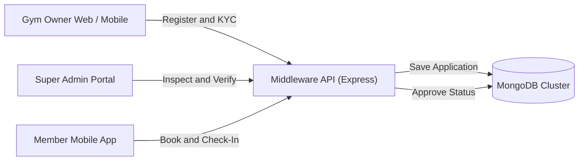

# GYMEZY Platform Documentation Directory

Welcome to the official technical documentation repository for the **GYMEZY** enterprise fitness platform.

## Documentation Index

| Document | Description | Target Platforms |
|---|---|---|
| **[LOGIC_FLOW.md](./LOGIC_FLOW.md)** | **Master Production Logic Flow & Architecture Specification**. Contains end-to-end Mermaid sequence diagrams, state machines, RBAC tables, registration & verification flows, API contracts, Mongoose models, and cross-platform network architecture. | Super Admin Web, Gym Owner Web, Gym Owner Mobile, Middleware API |
| **[../PROJECT_DOCUMENTATION_AND_DB_ARCHITECTURE.md](../PROJECT_DOCUMENTATION_AND_DB_ARCHITECTURE.md)** | High-level DB Entity-Relationship Diagram (ERD), non-functional requirements, and seed platform accounts. | Database & Product Specs |

---

## Quick Reference Architecture

